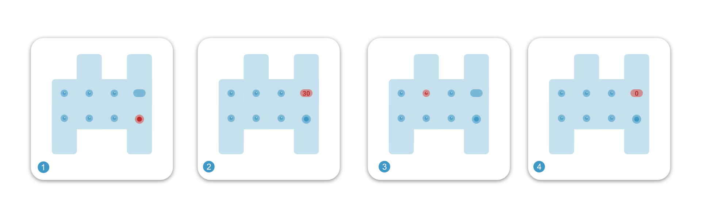
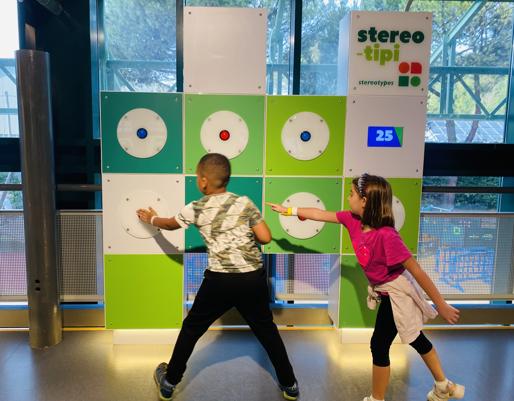

# Riflessi - Whac-a-mole


[](https://mdbr.it/en/) [](https://en.wikipedia.org/wiki/Interactive_art)

*Whac-a-mole* is a Python app that works like the classic **whac-a-mole game**, relying on a **led-button physical interface**.

- [Introduction](#introduction)
- [Development](#development)
- [Project additional infos](#infos)


## <a name="introduction"></a>Introduction
*Whac-a-mole* is part of an interactive installations network (read the paragraph [Project purpose](#purpose) for more information). Before engaging with the installations users are given a barcode to initialize the installations and to store their scores (and other non-sensible data).

*Whac-a-mole* is designed to test user reflexes. It controls button leds switch and checks if a button is pressed
Led buttons are turned on randomically and the user can press them.
The app **checks and saves how many buttons have been correctly pressed in a time range** (default is 30”).


### How it works
1. User starts application making it read the barcode
2. Countdown starts
3. Led buttons randomically turns on and user press them
4. Countdown reaches 0
5. Game is over




## <a name="development"></a>Development
### Dependencies:
- [jQuery](https://github.com/jquery/jquery)
- [legacy-display-server](https://github.com/ExploraMDBR/legacy-display-server)

jQuery dependency already comes with the repository (in `./public` folder).

```bash
# Clone repo
git clone https://github.com/ExploraMDBR/next-stop.git

# Run the installation script. Be sure to have internet access  
install.sh

# The script will return a random generated password for the DB, copy it and paste it in "./database_manager.py"
```


## <a name="infos"></a>Project additional infos

### <a name="purpose"></a>Project purpose
*Whac-a-mole* is designed as an installation part of the PARI a thematic expo focused on gender stereotipes and presented as a network of installations. All the installations features a challenge to the user and a final score. 
Some of the interactive installations are inspired to stereotiped gender task (like changing a toddler’s diaper), other like *Whac-a-mole* are oriented to emphasize the neutrality of some skills, like the reflexes.
Users, before starting the thematic expo, are given a barcode associated with a digital identity where are stored some non-sensible data like: gender, age range, nickname and the scores. Those data were used to have a glimpse of what cultural background kids have, based on their gender.



### Related Explora's project

- [MDBR heart rate]()
- [Economiamo - Car]()


